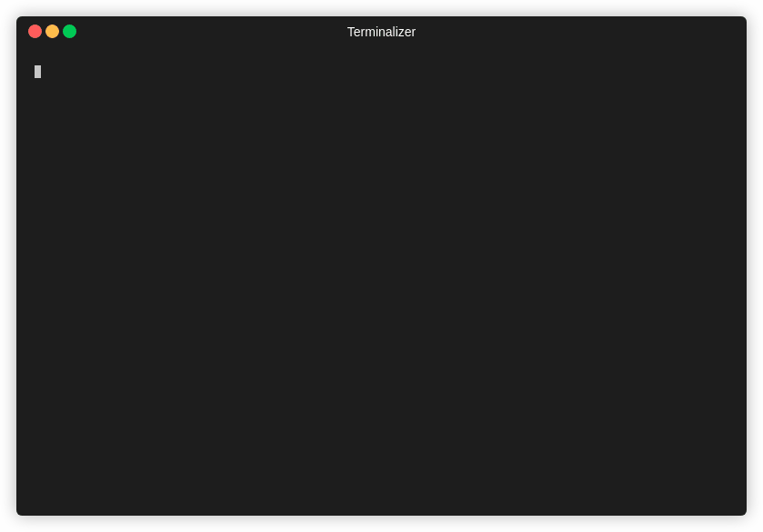
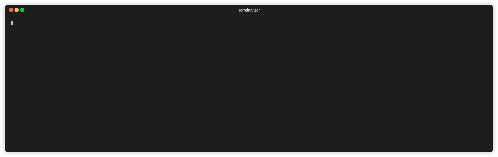

<p align="center">
<br>
<u><b> Turns a 17 minutes Nmap scan into 19 seconds. </b></u><br> Find all open ports <b>fast</b> with Rustscan, automatically pipe them into Nmap. 
</p>
<p align="center">


</p>
<hr>


| <p align="center"><a href="https://crates.io/crates/rustscan">🔧 Cargo (Universal) </a></p> | <p align="center"><a href="https://crates.io/crates/rust_scan"> Arch </a></p> | <p align="center"><a href="https://crates.io/crates/rust_scan"> HomeBrew </a></p> | <p align="center"><a href="https://crates.io/crates/rust_scan"> Kali / Debian </p> |
| ---- | ---- | ---- | --- |
| <p align="center"></p>  | <p align="center"></p> | <p align="center"></p> | <p align="center"></p> |
| **Version 1.1.0** | Version 1.0.0 | Version 1.0.0 | Version 1.0.0 |
| `cargo install rustscan` | `yay rustscan` | `brew tap brandonskerritt/rustscan && brew install rustscan` | [Read the install guide](https://github.com/brandonskerritt/RustScan/blob/master/README.md#%EF%B8%8F-debian--kali) |

**Note**: Version 1.1 runs in 8 seconds with batch size 10,000, version 1 runs in ~26 seconds on 1k threads, or average 1 - 2 minutes. I am updating the other package, but for maximum speed and latest support please use Cargo.
<hr>

# 🤔 What is this?
1. Find ports quickly using Rustscan (**8 seconds at its fastest**).
2. Automatically runs `nmap` on those ports.
3. Profit???

<table>
  <tr>
  <th>Name</th>
    <th>⚡ Nmap <b>with RustScan</b> ⚡ </th>
    <th>🐢 Nmap 🐢</th>
  </tr>
  <tr>
  <th>Gif</th>
    <td></td>
    <td></td>
  </tr>
  <tr>
  <th>Time</th>
    <td><b>39 seconds</b></td>
    <td><b>17 minutes and 41 seconds</b></td>
  </tr>
</table>

<sub><b>Note</b> This is an older gif. RustScan's current top speed is 8 seconds for all 65k ports. This gif is 26 seconds.</sub><br>

RustScans **only** job is to reduce the friction between finding open ports and inputting them into nmap.

# ✨ Features
* Scans all 65k ports in **8 seconds** (on 10k batch size).
* Saves you time by automatically piping it into Nmap. No more manual copying and pasting!
* Does one thing and does it well. **Only** purpose is to improve Nmap, not replace it!
* Let's you choose what Nmap commands to run, or uses the default.

# 🔭 Why RustScan?
Why spend time running fast scans and manually copying the ports, or waiting for a 20 minute scan to finish when you can just do all 65k ports in less than a minute?



**RustScan running in 8 seconds and finding all open ports out of 65k.**

## 📊 RustScan vs Nmap vs MassScan

| **Name**                                                                                   | RustScan | Nmap | Masscan |
| ------------------------------------------------------------------------------------------ | -------- | ---- | ------- |
| Fast                                                                                       | ✅        | ❌    | ✅       |
| Actually useful                                                                            | ❌        | ✅    | ❌       |
| Realises it's not useful, and pipes the only useful data into the only useful port scanner | ✅        | ❌    | ❌       |


## 🙋 FAQ
> I think this would be a great port scanner on its own without Nmap!

No. If you want a fast port scanner, use Masscan.
> I have this great idea for a script to get information on ports / hosts

Great. Contribute it to Nmap! :D
> Not everyone has nmap installed....

If you're a pentester, then yes, you have Nmap installed. 

> I want to contribute!

Great! I'd love some help with this. Read the [contributing.md file](contributing.md) file for more information!

# 📖 Full Installation Guide
**You need Nmap**. If you have Kali Linux or Parrot OS installed, you already have Nmap. If not, [follow the nmap install guide](https://nmap.org/download.html).

The easiest way to install RustScan is to use one of the packages provided for your system, such as HomeBrew or Yay for Arch Linux.

The most universal way is to use `cargo`, Rust's built in package manager (think Pip but for Rust). [Follow this guide to installing Rust & Cargo](https://doc.rust-lang.org/cargo/getting-started/installation.html).

If you face any issues at all, please leave a GitHub issue. I have only tested this on Linux, so there may be issues for Mac OS or Windows. 

## 🖥️ Debian / Kali

Download the .deb file from the releases page:
[https://github.com/brandonskerritt/RustScan/releases/tag/1.0.1](https://github.com/brandonskerritt/RustScan/releases/tag/1.0.1)
Run the commpand `dpkg -i` on the file. Note: sometimes you can double click the file to achieve the same result.

## 🍺 HomeBrew

Tap the brew:

```
brew tap brandonskerritt/rustscan
```

Install it:

```
brew install rustscan
```

# 🤸 Usage

```
rustscan -h
```

The format is `rustcan -b 500 -T 1500 192.168.0.1` to scan 192.168.0.1 with 500 batch size with a timeout of 1500ms. The timeout is how long RustScan waits for a response until it assumes the port is closed.

The batch size determines how fast RustScan is. Set it to 65k, and it will scan all 65k ports at the same time. This means at at 65k batch size, RustScan will take TIMEOUT long to scan all ports. Essentially, if timeout is 1000ms, **RustScan can scan in 1 second**. 

Your operating system may not support this, but it is worth it to play around and see where your open file limit is. Shortly I will be releasing a dockerised version with a much larger open file limit, so this will be possible.
## 🔌 Nmap
To run your own nmap commands, end the RustScan command with `-- -A` where `--` indicates "end of RustScan flags, please do not parse anything further" and any flags after that will be entered into nmap.

RustScan automatically runs `nmap -vvv -p $PORTS $IP`. To make it run `-A`, execute the command `rustscan 127.0.0.1 -- -A`. 

**Note**: due to how Nmap behaves, sometimes you cannot SIGINT ctrl+c to end the scan and it acts like it is running in the background, but printing to STD::OUT. There is nothing I can do about this, unless I create a TTY shell for the sole purpose of running Nmap. Sorry 😓 I'll try to fix in an upcoming release. If any Rust experts want to help, please do!

## 🎯 Increasing speed / accuracy
* Batch size
This increases speed, by allowing us to process more at once. Something experimental I am working on is changing the open file limit. You can do this manually with `ulimit -n 70000` and then running rustscan with `-B 65535`. This _should_ scan all 65535 ports at the exact same time. But this is extremely experimental.

For non-experimental speed increases, slowly increase the batch size until it no longer gets open ports, or it breaks.
* Accuracy (and some speed)
To increase accuracy, the easiest way is to increase the timeout. The default is 1.5 seconds, by setting it to 4 seconds (4000) we are telling RustScan "if we do not hear back from a port in 4 seconds, assume it is closed".

Decreasing accuracy gives some speed bonus, but my testing found that batch size dramatically changed the speed whereas timeout did, but not so much.

# 🎪 Contributing
Please read the [contributing.md file](contributing.md)

# 💻 Other Hacking Projects By This Author
## 🧮 Ciphey
Ciphey is an automated decryption tool using artifical intelligence & natural language processing.
[Check it out here!](https://github.com/ciphey/ciphey)
## Contributors ✨
<!-- ALL-CONTRIBUTORS-BADGE:START - Do not remove or modify this section -->
[](#contributors-)
<!-- ALL-CONTRIBUTORS-BADGE:END -->

Thanks goes to these wonderful people ([emoji key](https://allcontributors.org/docs/en/emoji-key)):

<!-- ALL-CONTRIBUTORS-LIST:START - Do not remove or modify this section -->
<!-- prettier-ignore-start -->
<!-- markdownlint-disable -->
<table>
  <tr>
    <td align="center"><a href="https://skerritt.blog"><br /><sub><b>Brandon</b></sub></a><br /><a href="#infra-brandonskerritt" title="Infrastructure (Hosting, Build-Tools, etc)">🚇</a> <a href="https://github.com/brandonskerritt/RustScan/commits?author=brandonskerritt" title="Tests">⚠️</a> <a href="https://github.com/brandonskerritt/RustScan/commits?author=brandonskerritt" title="Code">💻</a> <a href="#design-brandonskerritt" title="Design">🎨</a></td>
  </tr>
</table>

<!-- markdownlint-enable -->
<!-- prettier-ignore-end -->
<!-- ALL-CONTRIBUTORS-LIST:END -->

This project follows the [all-contributors](https://github.com/all-contributors/all-contributors) specification. Contributions of any kind welcome!
