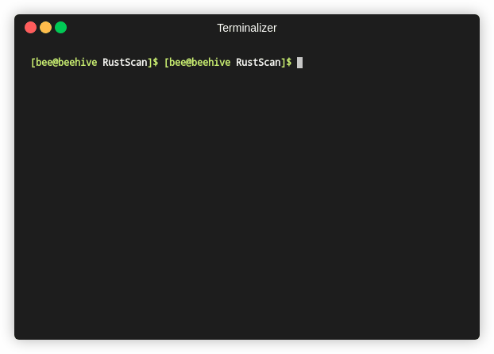
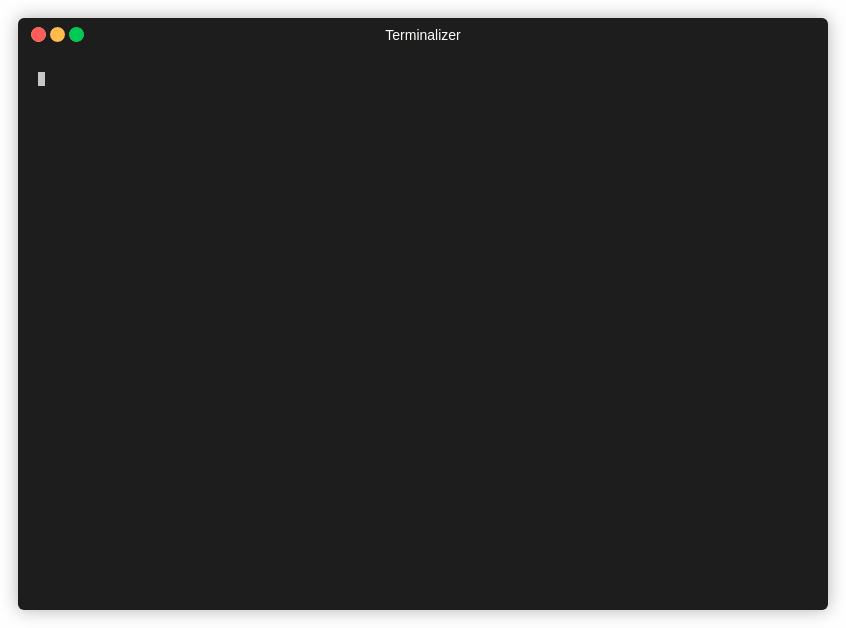

➡️
<a href="http://discord.skerritt.blog">Discord</a> |
 <a href="https://github.com/RustScan/RustScan/wiki/Installation-Guide">Installation Guide</a> |
 <a href="https://github.com/RustScan/RustScan#-usage">Usage Guide</a>
 ⬅️
 

<u><b> The Modern Port Scanner. </b></u> <b>Fast, smart, effective.</b> 

| <a href="https://hub.docker.com/r/cmnatic/rustscan">🐋 Docker (Recommended)</a> | <a href="https://github.com/RustScan/RustScan/releases">👩‍💻 Kali / Debian | <a href="https://aur.archlinux.org/packages/rustscan/">🏗️ Arch </a> | <a href="https://crates.io/crates/rustscan">🔧 Homebrew </a> |
|:-----------------------------------------------------------------------------------------------------------------:|:---------------------------------------------------------------------------------------------------------------:|:---------------------------------------------------------------------------------------------------------------:|:---------------------------------------------------------------------------------------------------------------:|
| 

 | 

 | 

 | 

 |
| `docker pull rustscan/rustscan:2.1.1` [Usage](https://github.com/RustScan/RustScan/wiki/Installation-Guide#docker-whale) | [Read the install guide](https://github.com/RustScan/RustScan/wiki/Installation-Guide#%EF%B8%8F-debian--kali)     | `yay -S rustscan` | `brew install rustscan` |

# 🤔 What is this?

The Modern Port Scanner. **Find ports quickly (3 seconds at its fastest)**. Run scripts through our scripting engine (Python, Lua, Shell supported).

# ✨ Features

- Scans all 65k ports in **3 seconds**.
- Full scripting engine support. Automatically pipe results into Nmap, or use our scripts (or write your own) to do whatever you want.
- Adaptive learning. RustScan improves the more you use it. No bloated machine learning here, just basic maths.
- The usuals you would expect. IPv6, CIDR, file input and more.
- Automatically pipes ports into Nmap.

## ‼️ Important Links

| Installation Guide                                                                     | Documentation                                            | Discord                                  |
| -------------------------------------------------------------------------------------- | -------------------------------------------------------- | ---------------------------------------- |
| 📖 [Installation Guide](https://github.com/RustScan/RustScan#-full-installation-guide) | 📚 [Documentation](https://rustscan.github.io/RustScan/) | 🦜 [Discord](http://discord.skerritt.blog) |

## 🙋 Table of Contents

- 📖 [Installation Guide](https://github.com/RustScan/RustScan/wiki/Installation-Guide)
- 🐋 [Docker Usage](https://github.com/RustScan/RustScan/wiki/Installation-Guide)
- 🦜 [Discord](http://discord.skerritt.blog)
- 🤸 [Usage](https://github.com/RustScan/RustScan/wiki/Usage)
- 🎪 [Community](https://github.com/RustScan/RustScan#-community)

# 🔭 Why RustScan?

RustScan is a modern take on the port scanner. Sleek & fast. All while providing extensive extendability to you.

Not to mention RustScan uses Adaptive Learning to improve itself over time, making it the best port scanner for **you**.

## 🧋 Speed

Speed is guaranteed via RustScan. However, if you want to run a slow scan due to stealth that is possible too.

Firstly, let's talk code.

We have tests that check to see if RustScan is significantly slower than the previous version. If it is, the continuous integration fails and we can't commit code to master unless we make it faster.

[HyperFine](https://github.com/sharkdp/hyperfine) is used to monitor RustScan's performance over time to answer the question "Are we getting faster? Are we getting slower?".

Every pull request is reviewed by 1 person, but more often than not 2 people review it. We test it manually and make sure the code doesn't affect performance negatively.

[Read more here](https://github.com/RustScan/RustScan/wiki/Increasing-Speed-&-Accuracy).

## ⚙️ Extensible 

_RustScan piping results into the custom Python script_

RustScan has a new scripting engine which allows anyone to write scripts in most languages. Python, Lua, Shell are all supported.

Want to take your found ports and pipe them into Nmap for further analysis? That's possible. Want to run `smb-enum` if SMB is found open? Possible.

The possibilities are endless -- and you can write scripts in whatever language you feel comfortable with.

[Read more here](https://github.com/RustScan/RustScan/wiki/RustScan-Scripting-Engine).

## 🌊 Adaptive

_RustScan automatically fine-tuning itself to match the host OS_.

RustScan has a cool set of features called "Adaptive Learning". These features "learn" about the environment you are scanning and how _you_ use RustScan to **improve itself over time**.

This is an umbrella term we use for any feature that fits this criteria. The list is constantly changing, so [check out our wiki for more information](https://github.com/RustScan/RustScan/wiki/Adaptive-Learning).

## 👩‍🦯 Accessible

RustScan is one of the first penetration testing tools that aims to be entirely accessible. 

[Most penetration testing tools are not accessible](https://bees.substack.com/p/making-hacking-accessible), which negatively affects the whole industry.

RustScan has continuous integration testing that aims to make sure it is accessible, and we are constantly working on ways to improve our accessibility and make sure _everyone_ can use RustScan.

# 📖 Full Installation Guide

You can find our guide [here](https://github.com/RustScan/RustScan/wiki/Installation-Guide).

## 🦊 Community Distributions

Here are all of RustScan's community distributions.

If you maintain a community distribution and want it listed here, leave an issue / pull request / Discord message or however you want to let us know.

- [OpenSuse](https://software.opensuse.org/package/rustscan?search_term=rustscan)
- [Fedora/CentOS](https://copr.fedorainfracloud.org/coprs/atim/rustscan/)

# 🤸 Usage

We have 2 usage guides. [Basic Usage](https://github.com/RustScan/RustScan/wiki/Usage) and [Things you may want to do](https://github.com/RustScan/RustScan/wiki/Things-you-may-want-to-do-with-RustScan-but-don't-understand-how).

We also have documentation about our config file [here](https://github.com/RustScan/RustScan/wiki/Config-File).

# 🎪 Community

[Read this to learn how to contribute](https://github.com/RustScan/RustScan/wiki/Contributing).

## Contributors ✨

<!-- ALL-CONTRIBUTORS-BADGE:START - Do not remove or modify this section -->

<!-- ALL-CONTRIBUTORS-BADGE:END -->

Thanks goes to these wonderful people ([emoji key](https://allcontributors.org/docs/en/emoji-key)):

<!-- ALL-CONTRIBUTORS-LIST:START - Do not remove or modify this section -->
<!-- prettier-ignore-start -->
<!-- markdownlint-disable -->
<table>
  <tr>
    <td align="center"><a href="https://skerritt.blog"> <b>Brandon</b></a> <a href="#infra-brandonskerritt" title="Infrastructure (Hosting, Build-Tools, etc)">🚇</a> <a href="https://github.com/RustScan/RustScan/commits?author=brandonskerritt" title="Tests">⚠️</a> <a href="https://github.com/RustScan/RustScan/commits?author=brandonskerritt" title="Code">💻</a> <a href="#design-brandonskerritt" title="Design">🎨</a></td>
    <td align="center"><a href="https://sakiir.ovh"> <b>SakiiR</b></a> <a href="https://github.com/RustScan/RustScan/commits?author=SakiiR" title="Code">💻</a> <a href="https://github.com/RustScan/RustScan/issues?q=author%3ASakiiR" title="Bug reports">🐛</a></td>
    <td align="center"><a href="https://github.com/smackhack"> <b>smackhack</b></a> <a href="#ideas-smackhack" title="Ideas, Planning, & Feedback">🤔</a> <a href="#example-smackhack" title="Examples">💡</a></td>
    <td align="center"><a href="http://bernardoamc.github.io/"> <b>Bernardo Araujo</b></a> <a href="https://github.com/RustScan/RustScan/commits?author=bernardoamc" title="Code">💻</a> <a href="https://github.com/RustScan/RustScan/issues?q=author%3Abernardoamc" title="Bug reports">🐛</a> <a href="#design-bernardoamc" title="Design">🎨</a></td>
    <td align="center"><a href="https://github.com/Isona"> <b>Izzy Whistlecroft</b></a> <a href="https://github.com/RustScan/RustScan/issues?q=author%3AIsona" title="Bug reports">🐛</a></td>
    <td align="center"><a href="https://imlonghao.com"> <b>imlonghao</b></a> <a href="https://github.com/RustScan/RustScan/issues?q=author%3Aimlonghao" title="Bug reports">🐛</a> <a href="#maintenance-imlonghao" title="Maintenance">🚧</a></td>
    <td align="center"><a href="https://github.com/royharoush"> <b>royharoush</b></a> <a href="#ideas-royharoush" title="Ideas, Planning, & Feedback">🤔</a> <a href="#design-royharoush" title="Design">🎨</a></td>
  </tr>
  <tr>
    <td align="center"><a href="https://github.com/Atul9"> <b>Atul Bhosale</b></a> <a href="https://github.com/RustScan/RustScan/commits?author=Atul9" title="Code">💻</a></td>
    <td align="center"><a href="https://tgotwig.me"> <b>Thomas Gotwig</b></a> <a href="#platform-TGotwig" title="Packaging/porting to new platform">📦</a></td>
    <td align="center"><a href="https://github.com/remigourdon"> <b>Rémi Gourdon</b></a> <a href="https://github.com/RustScan/RustScan/commits?author=remigourdon" title="Documentation">📖</a> <a href="https://github.com/RustScan/RustScan/commits?author=remigourdon" title="Code">💻</a></td>
    <td align="center"><a href="https://cmnatic.co.uk"> <b>Ben (CMNatic)</b></a> <a href="https://github.com/RustScan/RustScan/commits?author=cmnatic" title="Code">💻</a> <a href="https://github.com/RustScan/RustScan/commits?author=cmnatic" title="Documentation">📖</a> <a href="#design-cmnatic" title="Design">🎨</a></td>
    <td align="center"><a href="https://github.com/Ferryistaken"> <b>Alessandro Ferrari</b></a> <a href="#content-Ferryistaken" title="Content">🖋</a></td>
    <td align="center"><a href="https://github.com/Phenomite"> <b>Phenomite</b></a> <a href="#content-Phenomite" title="Content">🖋</a></td>
    <td align="center"><a href="https://supersandro.de/"> <b>Sandro</b></a> <a href="#content-SuperSandro2000" title="Content">🖋</a> <a href="https://github.com/RustScan/RustScan/issues?q=author%3ASuperSandro2000" title="Bug reports">🐛</a> <a href="https://github.com/RustScan/RustScan/commits?author=SuperSandro2000" title="Code">💻</a></td>
  </tr>
  <tr>
    <td align="center"><a href="https://swag.lgbt"> <b>Cass</b></a> <a href="#platform-caass" title="Packaging/porting to new platform">📦</a> <a href="https://github.com/RustScan/RustScan/commits?author=caass" title="Code">💻</a> <a href="https://github.com/RustScan/RustScan/issues?q=author%3Acaass" title="Bug reports">🐛</a></td>
    <td align="center"><a href="https://github.com/niklasmohrin"> <b>Niklas Mohrin</b></a> <a href="https://github.com/RustScan/RustScan/commits?author=niklasmohrin" title="Documentation">📖</a> <a href="https://github.com/RustScan/RustScan/commits?author=niklasmohrin" title="Code">💻</a> <a href="https://github.com/RustScan/RustScan/issues?q=author%3Aniklasmohrin" title="Bug reports">🐛</a></td>
    <td align="center"><a href="https://liberapay.com/Artem4/"> <b>Artem Polishchuk</b></a> <a href="#platform-tim77" title="Packaging/porting to new platform">📦</a></td>
    <td align="center"><a href="https://github.com/buermarc"> <b>buermarc</b></a> <a href="https://github.com/RustScan/RustScan/commits?author=buermarc" title="Code">💻</a></td>
    <td align="center"><a href="https://github.com/bergabman"> <b>bergabman</b></a> <a href="https://github.com/RustScan/RustScan/commits?author=bergabman" title="Code">💻</a> <a href="https://github.com/RustScan/RustScan/issues?q=author%3Abergabman" title="Bug reports">🐛</a> <a href="#design-bergabman" title="Design">🎨</a></td>
    <td align="center"><a href="https://github.com/dmitris"> <b>Dmitry Savintsev</b></a> <a href="https://github.com/RustScan/RustScan/commits?author=dmitris" title="Code">💻</a></td>
    <td align="center"><a href="https://github.com/bofh69"> <b>Sebastian Andersson</b></a> <a href="https://github.com/RustScan/RustScan/commits?author=bofh69" title="Code">💻</a></td>
  </tr>
  <tr>
    <td align="center"><a href="https://github.com/mattcorbin"> <b>Matt Corbin</b></a> <a href="https://github.com/RustScan/RustScan/commits?author=mattcorbin" title="Code">💻</a></td>
    <td align="center"><a href="http://rootsploit.com"> <b>RootSploit</b></a> <a href="#blog-rootsploit" title="Blogposts">📝</a></td>
    <td align="center"><a href="https://github.com/eiffel-fl"> <b>eiffel-fl</b></a> <a href="https://github.com/RustScan/RustScan/commits?author=eiffel-fl" title="Code">💻</a></td>
    <td align="center"><a href="https://github.com/u5surf"> <b>Y.Horie</b></a> <a href="https://github.com/RustScan/RustScan/commits?author=u5surf" title="Code">💻</a></td>
    <td align="center"><a href="https://github.com/okrplay"> <b>Oskar</b></a> <a href="https://github.com/RustScan/RustScan/commits?author=okrplay" title="Code">💻</a> <a href="https://github.com/RustScan/RustScan/commits?author=okrplay" title="Tests">⚠️</a></td>
  </tr>
</table>

<!-- markdownlint-enable -->
<!-- prettier-ignore-end -->
<!-- ALL-CONTRIBUTORS-LIST:END -->

This project follows the [all-contributors](https://github.com/all-contributors/all-contributors) specification. Contributions of any kind welcome!
